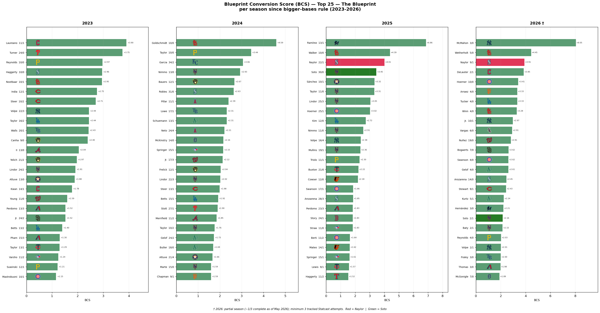
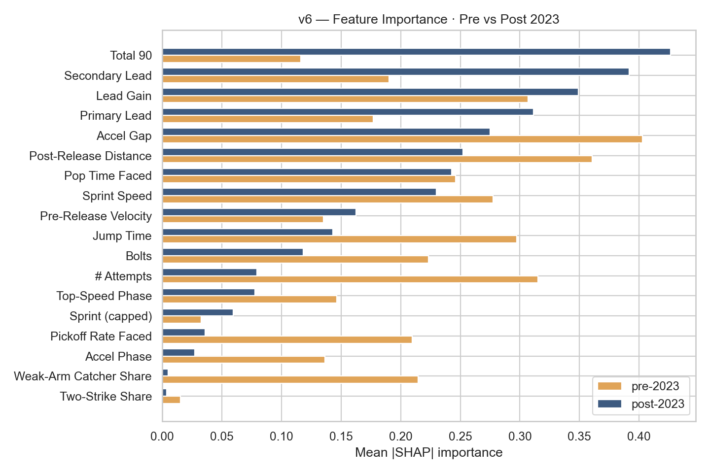
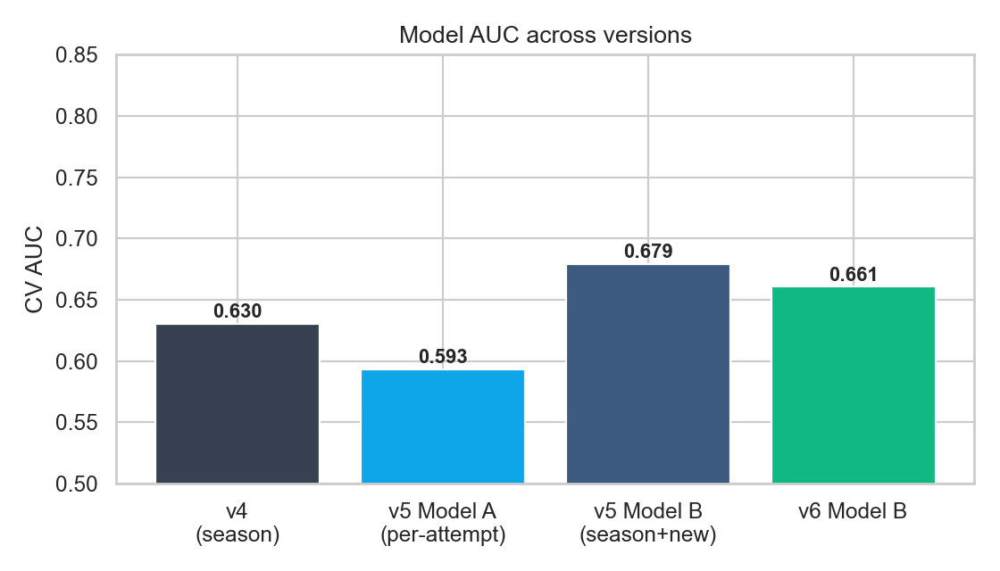
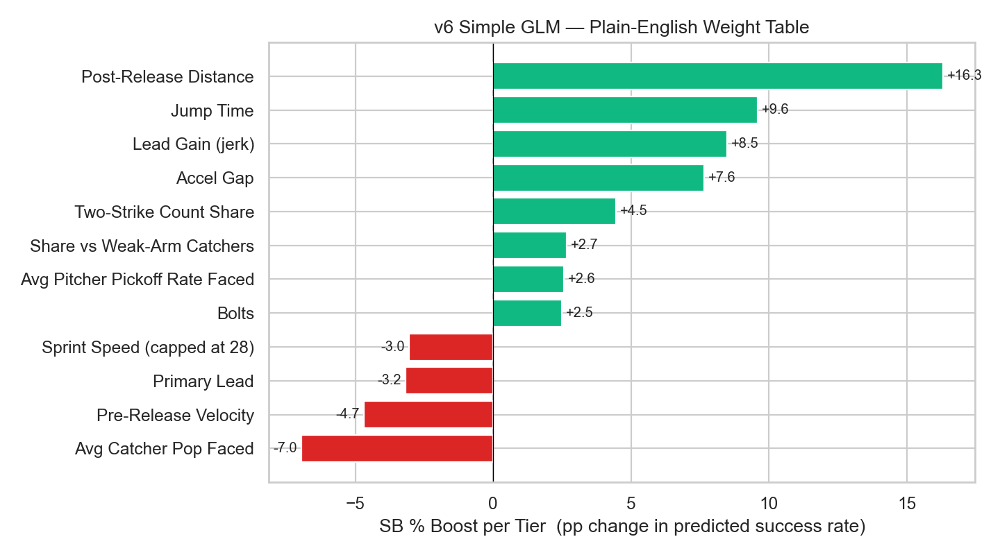

# The Naylor Model

José Caballero led MLB in net stolen bases in 2025 running a quarter-second slower than Chandler Simpson. Shohei Ohtani was the second most productive base-stealer in 2024 despite being 0.14 seconds slower than Elly De La Cruz. Most strikingly, Josh Naylor stole 20 bases above average at 93.8% success while running slower than 97% of the league. Sprint speed is the most intuitive base-stealing metric — it is not the most essential one.

What separates these runners is technique — and technique is coachable precisely because it reflects what a player has learned to do with their body, not what their body is built to do. Sprint speed is structural. Primary lead distance, secondary lead timing, and first-step burst off the pitcher's first move are behavioral patterns that haven't permanently locked in, which means they can be shifted.

Sprint biomechanics research points to three specific targets every baseball player can develop regardless of raw speed: shorter ground contact time, more distance covered in the first five-foot window from the pitcher's first move, and earlier recognition of delivery cues. These aren't elite-only adaptations — they are timing and sequencing refinements accessible to any MLB-level runner. Naylor's edge isn't a physical gift; it's that he optimizes all three within a body most evaluators would write off.

That's why specificity with the biomechanics suite matters. Knowing a runner has a "slow jump" isn't actionable. Knowing exactly where in the ground contact phase they're losing time, and at which keyframe their secondary lead stalls, is. The more precisely the metric targets the problem, the more directly the coaching intervention follows.

---

## Navigation

| | |
|---|---|
| 📄 **[Full Report](Reports/Naylor_Model_v6_Report.pdf)** | Complete v6 analysis — models, AUC, SSSI leaderboard, Naylor/Soto profile |
| 🧬 **[Blueprint Report](Reports/Naylor_Blueprint_Report.pdf)** | Full-spectrum Blueprint Conversion Score — top (Naylor archetype) to bottom (fast squanderers), 2023–2025 |
| 📖 **[Variable Glossary](Reports/Variable_Glossary.pdf)** | Plain-English reference for every metric. Tier charts, real examples, full model discussion |
| 🖼️ **[Figures](Figures/)** | All charts and visualizations |
| 📊 **[Data Frame](Data%20Frame/)** | All output CSVs — leaderboards, SSSI rankings, model results |
| 🧠 **[Computer Vision](Computer%20Vision/)** | Statcast Analysis Core (Blueprint model) + archived CV delivery-time pilot |
| 🗂️ **[Previous Versions](Previous%20Versions/)** | Archived v3, v4, v5 pipelines and outputs |

---

## Key Results

### Naylor & Soto Profile


### Blueprint Conversion Score — Top 25 Per Season (2023–2026)


### Feature Importance — Pre vs Post 2023


### Model Accuracy (AUC)


### GLM Weight Table — What Actually Moves the Needle


---

## How It Works

The core signal is the **SB Residual**: a runner's actual success rate minus the rate their sprint speed alone would predict. Positive means they outperform their speed peers. The model is built on real Statcast data — sprint speed, 5-ft running splits (0–90 ft), catcher pop times, pitcher running-game suppression, and season SB/CS records from 2015–2026.

### Key Metrics

| Metric | What it captures |
|---|---|
| `sprint_speed` | Top running speed (ft/s) — structural baseline |
| `speed_capped` | Sprint speed capped at 28 ft/s — marginal benefit vanishes above this |
| `jump_time` | Time to cover the first 30 ft — first-step burst, independent of top speed |
| `accel_gap` | Jump time percentile minus sprint speed percentile — positive = faster off the line than top speed implies (the Naylor archetype) |
| `sb_residual` | Real SB% minus speed-expected SB% — ground-truth speed-adjusted steal skill |
| `lead_gain` | Distance gained in secondary lead — a coachable behavioral pattern |
| `avg_pop_faced` | Catcher pop time in this runner's matchups — battery context |
| `avg_pickoff_rate_faced` | Pitcher hold frequency — suppression context |

### The SSSI — Slow-Steal Skill Index

A weighted composite of eight z-scored features designed to surface the Naylor/Soto archetype: elite-performing slow runners. Weights were optimised on 80% of runners with Naylor and Soto held out entirely — their ranking is a genuine out-of-sample result.

| Rank | Player | Season | SSSI |
|---|---|---|---|
| 1 | Josh Naylor | 2025 | +1.90 |
| 2 | Josh Naylor | 2026 | +1.84 |
| 3 | Freddie Freeman | 2024 | +1.71 |
| 5 | Juan Soto | 2025 | +1.43 |

### Blueprint Conversion Score — Top 5 All-Time (2023–2026)

| Rank | Player | Team | Season | BCS |
|---|---|---|---|---|
| 1 | Ryan McMahon | NYY | 2026 † | +8.05 |
| 2 | Agustín Ramírez | MIA | 2025 | +6.86 |
| 3 | Paul Goldschmidt | STL | 2024 | +4.59 |
| 6 | Josh Naylor | SEA | 2025 | +4.01 |
| 11 | Juan Soto | NYM | 2025 | +3.45 |

*† 2026 partial season (~1/3 complete, May 2026); min 3 tracked Statcast attempts.*

### Models

| Model | Unit | AUC | Purpose |
|---|---|---|---|
| **Model B** (season GBM) | Runner-season | 0.662–0.700 | Headline predictor |
| Model A (per-attempt GBM) | Individual attempt | ~0.59 | Strict noise-floor test |
| GLM | Runner-season | — | Interpretable weight table |

---

## How to Run

```bash
# Full v6 model pipeline
python3 v6_explore.py        # full pipeline → "Data Frame"/, Figures/, Reports/
python3 write_glossary.py    # regenerate Variable Glossary → Reports/

# Blueprint pipeline (Jupyter notebooks — recommended)
jupyter notebook "Computer Vision/Statcast Analysis Core/Data Pipeline.ipynb"
jupyter notebook "Computer Vision/Statcast Analysis Core/Blueprint Analysis.ipynb"

# Or run scripts directly (requires network for data pipeline)
python3 "Computer Vision/Statcast Analysis Core/ground_covered_leaderboard.py"
python3 "Computer Vision/Statcast Analysis Core/naylor_blueprint.py"
```

---

## Repository Structure

```
The-Naylor-Model/
├── v6_explore.py              ← full v6 pipeline (SSSI, Model B, GLM, figures)
├── write_glossary.py          ← Variable Glossary generator
├── Figures/                   ← all output PNGs (incl. per-season BCS figures + logos/)
├── Data Frame/                ← Naylor Blueprint.xlsx (4 sheets), v6 Model.xlsx (9 sheets)
├── Reports/                   ← Naylor Blueprint Report.docx, PDF reports, glossary
├── Computer Vision/
│   ├── Statcast Analysis Core/
│   │   ├── Data Pipeline.ipynb        ← discover runners + fetch leads + ground covered
│   │   ├── Blueprint Analysis.ipynb   ← BCS scoring + figures + DOCX rebuild
│   │   ├── discover_runners.py        ← Savant sprint/SB universe fetcher
│   │   ├── fetch_leads.py             ← per-attempt leads fetcher (imported by pipeline)
│   │   ├── ground_covered_leaderboard.py ← gain-to-release leaderboard (2023–2026)
│   │   ├── naylor_blueprint.py        ← BCS model + per-season Top/Bot 25 tables
│   │   └── build_blueprint_report.js  ← Node.js DOCX builder
│   ├── discovery/             ← runner universe CSVs (2023–2026)
│   └── discovery/leads_cache/ ← per-attempt leads cache (gitignored, regenerable)
└── Previous Versions/
    ├── v3/                    ← naylor_model.py + v3 outputs
    ├── v4/                    ← v4_explore.py + v4 outputs
    └── v5/                    ← v5_explore.py + v5 outputs
```

---

## Data Sources

- Baseball Savant: sprint speed, running splits, catcher pop times, pitcher running-game leaderboard, base-stealing run value
- MLB Stats API: season SB/CS records (2015–2026)
- Statcast pitch-level feed: per-pitch runner context, battery matchups
