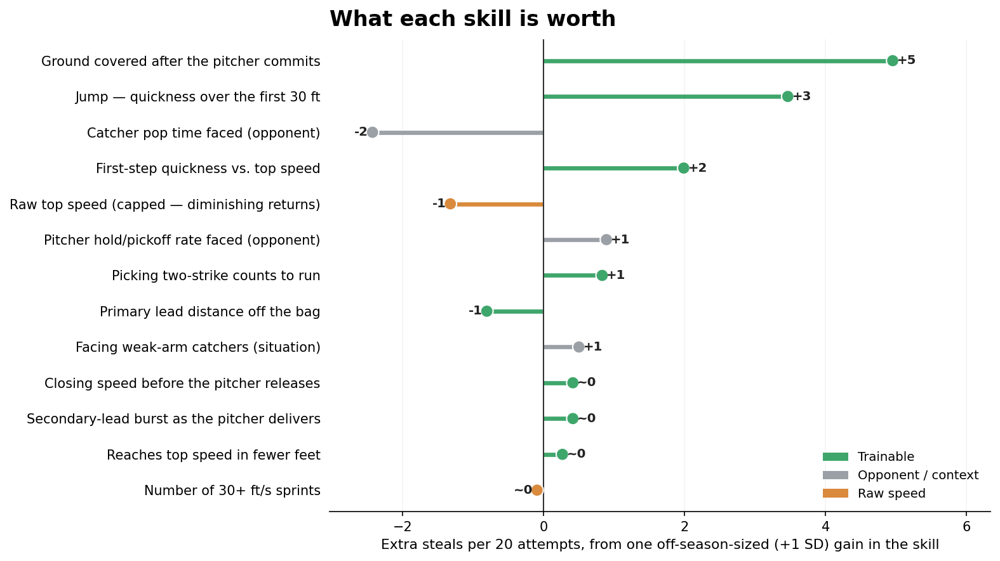
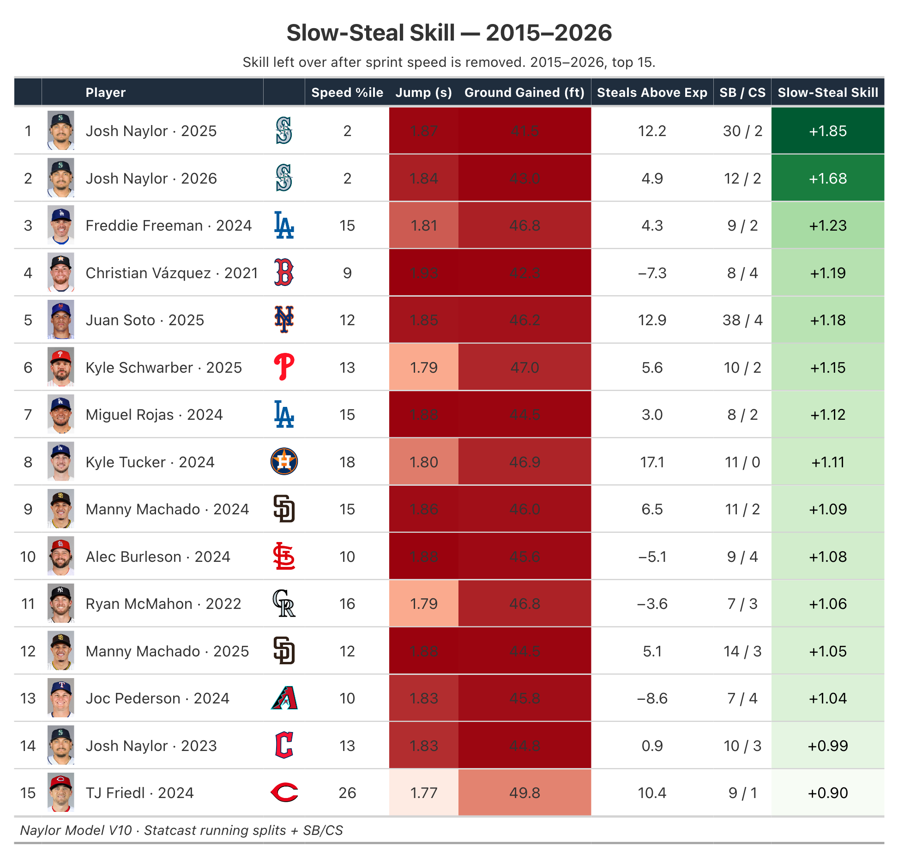
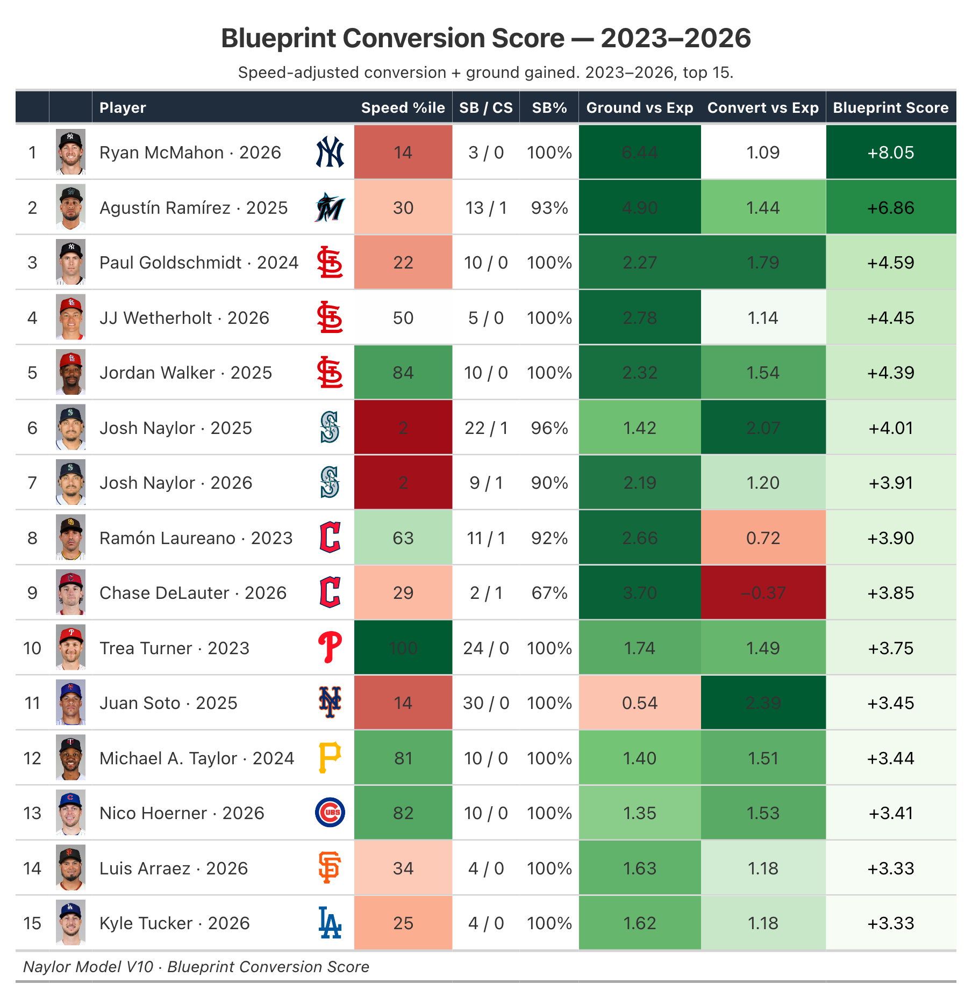
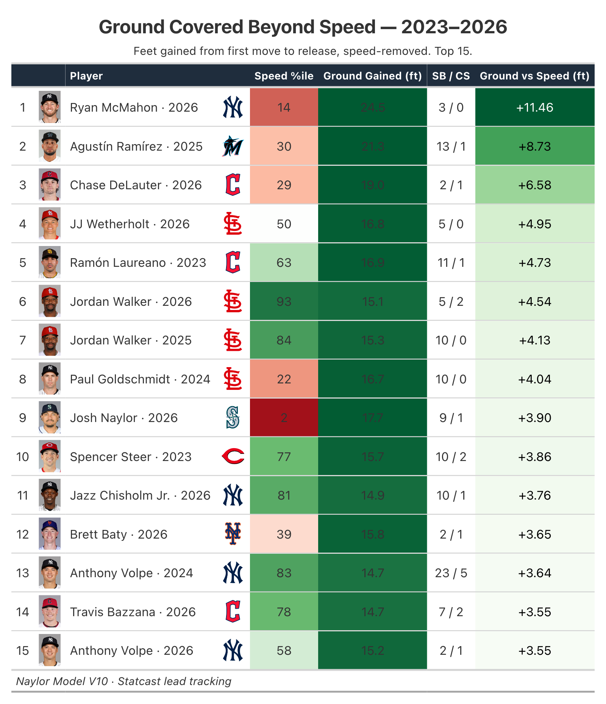
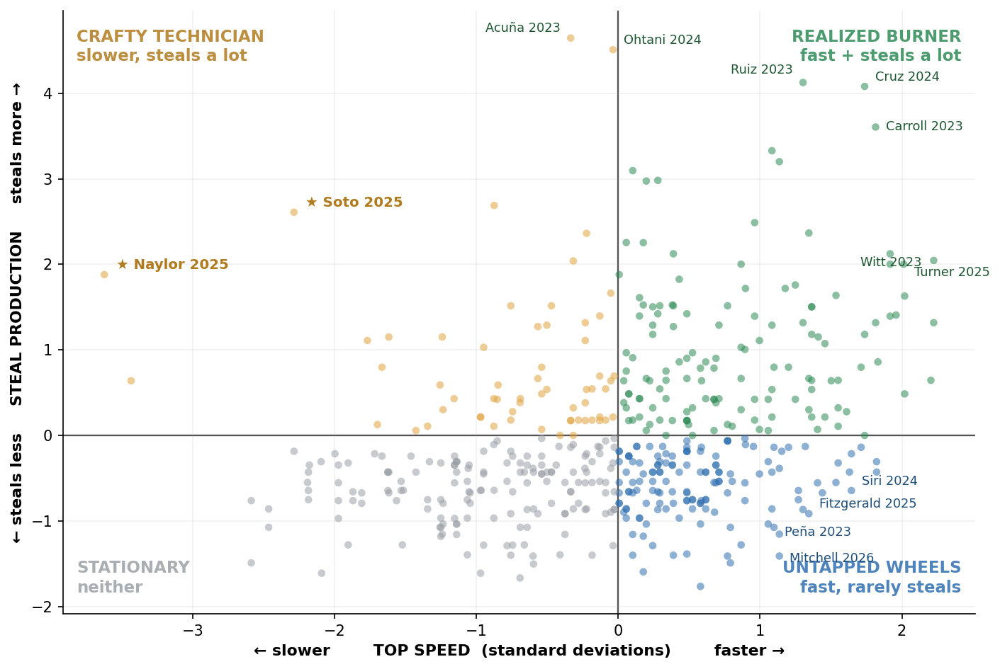
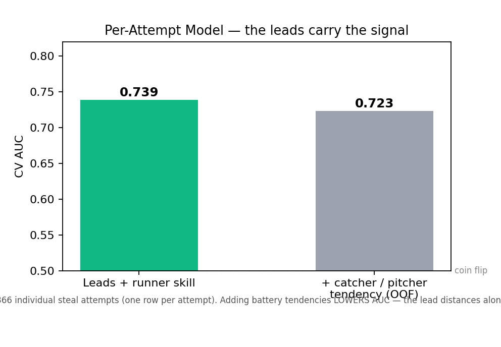

# The Naylor Model

> ### Open this first  (V10)
> | If you want to… | Open |
> |---|---|
> | **Read the findings** (coaches / R&D) | **[`Naylor_Model_V10_Report.docx`](Naylor_Model_V10_Report.docx)** |
> | **Run the model** end-to-end | **[`Naylor_Model.ipynb`](Naylor_Model.ipynb)** |
> | **See the raw data** | `Data/Raw_Season.csv` (runner-seasons) · `Data/Raw_Attempts.csv` (per attempt) |
> | **See the outputs** | `Output/Tables/` (Statcast leaderboards) · `Output/Figures/` · `Output/Results/` |
> | **Improve the AUC** | [`AUC_Roadmap.md`](AUC_Roadmap.md) |
>
> Everything else is plumbing: `Scripts/` (code) · `Reports/` (appendix + methods guide) ·
> `Computer Vision/` (CV pilot) · `Previous Versions/` (v3–v8).

---

José Caballero led MLB in net stolen bases in 2025 running a quarter-second slower than Chandler Simpson. Shohei Ohtani was the second most productive base-stealer in 2024 despite being 0.14 seconds slower than Elly De La Cruz. Most strikingly, Josh Naylor stole 20 bases above average at 93.8% success while running slower than 97% of the league. Sprint speed is the most intuitive base-stealing metric — it is not the most essential one.

What separates these runners is technique — and technique is coachable precisely because it reflects what a player has learned to do with their body, not what their body is built to do. Sprint speed is structural. Primary lead distance, secondary lead timing, and first-step burst off the pitcher's first move are behavioral patterns that haven't permanently locked in, which means they can be shifted.

Sprint biomechanics research points to three specific targets every baseball player can develop regardless of raw speed: shorter ground contact time, more distance covered in the first five-foot window from the pitcher's first move, and earlier recognition of delivery cues. These aren't elite-only adaptations — they are timing and sequencing refinements accessible to any MLB-level runner. Naylor's edge isn't a physical gift; it's that he optimizes all three within a body most evaluators would write off.

That's why specificity with the biomechanics suite matters. Knowing a runner has a "slow jump" isn't actionable. Knowing exactly where in the ground contact phase they're losing time, and at which keyframe their secondary lead stalls, is. The more precisely the metric targets the problem, the more directly the coaching intervention follows.

---

## Navigation

| | |
|---|---|
| ⭐ **[Main Report — V10 (DOCX)](Naylor_Model_V10_Report.docx)** | **Start here.** Applied report for MLB R&D + coaches — what each skill is worth (in steals), Statcast-style leaderboards of who already has it, the speed-vs-production quadrant, and a **2025 coaching target board** (green-light vs. technique-fix). Built around the *trait* — a slow runner who steals better than ~99% of MLB — not any one player |
| 🧾 **[V10 Technical Appendix (DOCX)](Reports/Naylor_Model_V10_Technical_Appendix.docx)** | Full detail for auditors — the per-attempt model (Model A) + interpretable GLM, complete GLM weight table, full SSSI Top 25, xSB leaderboards, and the Blueprint Conversion Score with **team logos** |
| 📓 **[Master Notebook](Naylor_Model.ipynb)** | End-to-end pipeline — raw data → per-attempt model (~10k rows) → SSSI → GLM → xSB → Statcast tables → report |
| 🖼️ **[Statcast leaderboards](Output/Tables/)** | Slow-Steal Skill, Blueprint Conversion, Ground Covered — headshot + team logo + heat-colored headline |
| 🗺️ **[AUC Roadmap](AUC_Roadmap.md)** | How to push the model's AUC higher — the untapped matchup variables, ranked |
| 📖 **[Methods & Metrics Guide](Reports/Naylor_Model_Methods_and_Metrics.docx)** | How the data was scraped → aggregated → turned into every metric, the model specs (CV protocol, tuned params), an expert-question defense Q&A, known limitations, and a compact metric glossary. Built for defense / interview prep |
| 🧠 **[Computer Vision](Computer%20Vision/)** | All CV analysis — Statcast Analysis Core (Blueprint model) + the CV delivery-time pilot |
| 🗂️ **[Previous Versions](Previous%20Versions/)** | Archived v3–v8 pipelines, reports, and figures |

---

## Key Results

### What Each Skill Is Worth — in Steals
Each lever's payoff as extra steals over a 20-attempt season, from one off-season-sized (+1 SD) gain. Green = trainable, grey = opponent/context, orange = raw speed (barely moves the needle).


### Slow-Steal Skill — Who Already Has It


### Blueprint Conversion Score — The Full Skill Index


### Ground Covered Beyond Speed-Expected


### Expected SB Outcome (xSB) — Speed vs Production Quadrant


### Model Accuracy (AUC)


---

## How It Works

The core signal is the **SB Residual**: a runner's actual success rate minus the rate their sprint speed alone would predict. Positive means they outperform their speed peers. The model is built on real Statcast data — sprint speed, 5-ft running splits (0–90 ft), catcher pop times, pitcher running-game suppression, and season SB/CS records from 2015–2026.

### Key Metrics

| Metric | What it captures |
|---|---|
| `sprint_speed` | Top running speed (ft/s) — structural baseline |
| `speed_capped` | Sprint speed capped at 28 ft/s — marginal benefit vanishes above this |
| `jump_time` | Time to cover the first 30 ft — first-step burst, independent of top speed |
| `accel_gap` | Jump time percentile minus sprint speed percentile — positive = faster off the line than top speed implies (the Naylor archetype) |
| `accel_topspeed_premium` | **(v7)** How few feet a runner needs to reach top speed, speed-adjusted — a small runway at high speed is a premium |
| `sb_residual` | Real SB% minus speed-expected SB% — ground-truth speed-adjusted steal skill |
| `lead_gain` | Distance gained in secondary lead — a coachable behavioral pattern |
| `xsb_outcome` | **(v7)** `z(net SB above avg) + z(sprint speed)` — combined speed-and-production lens; high = fast AND productive |
| `sb_potential_gap` | **(v7)** `z(sprint) − z(net SB)` — positive = fast but under-stealing (untapped, coachable); negative = over-performs speed |
| `avg_pop_faced` | Catcher pop time in this runner's matchups — battery context |
| `avg_pickoff_rate_faced` | Pitcher hold frequency — suppression context |

### The Steal-Success Equation (v8 — applied)

A logistic model turns the metrics above into one readable equation:

> **chance of a successful steal = baseline (≈ 78%) + Σ ( weight × how far above average the runner is, in SDs )**

Each lever's weight is reported directly in **extra steals over a 20-attempt season** from one off-season-sized (+1 SD) gain. Three *trainable* levers dominate — ground covered after the pitcher commits (**+5 steals**), a quicker jump (**+3**), and reaching top speed in fewer feet (**+2**) — while raw top speed barely moves the needle. See `Output/Figures/Fig_Equation.png`.

### 2025 Coaching Target Board (v8 — applied)

The equation is turned into next steps via two honest, separated tracks — so a caught-prone runner is never simply told to "run more":

| Track | Who | The move |
|---|---|---|
| **Green-light** | Fast, efficient runners (≥ 80% success) who don't run enough | Just let them run — projected extra steals at their own rate |
| **Technique-fix** | High-volume runners caught too often (< 70% success) | Drill the *one* weakest trainable lever — projected success-rate gain |

The boards are priority rankings, not forecasts: *if unleashed* holds a runner at his own 2025 success rate and a modest ~20-attempt volume.

### The SSSI — Slow-Steal Skill Index

A weighted composite of nine z-scored features (v7 adds the Accel→Top-Speed Premium) designed to surface the Naylor/Soto archetype: elite-performing slow runners. Weights were optimised on 80% of runners with Naylor and Soto held out entirely — their ranking is a genuine out-of-sample result.

| Rank | Player | Season | SSSI |
|---|---|---|---|
| 1 | Josh Naylor | 2025 | +1.90 |
| 2 | Josh Naylor | 2026 | +1.84 |
| 3 | Freddie Freeman | 2024 | +1.71 |
| 5 | Juan Soto | 2025 | +1.43 |

### xSB — Expected Stolen-Base Outcome (v7)

A **complementary** lens to the SSSI. Where the SSSI surfaces slow-but-skilled stealers, **xSB = `z(net SB above avg) + z(sprint speed)`** surfaces the high-ceiling runners who are both fast *and* productive. The companion **`sb_potential_gap` = `z(sprint) − z(net SB)`** splits the league into four quadrants:

| Quadrant | Read |
|---|---|
| **Realized Burner** | Fast and productive — the complete package (e.g. Elly De La Cruz) |
| **Untapped Wheels** | Fast but under-stealing — coaching targets, split into *green-light* (efficient, just let them run) and *technique-fix* (caught too often, drill mechanics first) |
| **Crafty Technician** | Productive despite modest speed — the Naylor / Soto archetype |
| **Stationary** | Neither speed nor steal production |

xSB is descriptive, not predictive — it is deliberately kept out of the GBM (z(SB) would leak the outcome) and out of the SSSI composite.

### Blueprint Conversion Score — Top 5 All-Time (2023–2026)

| Rank | Player | Team | Season | BCS |
|---|---|---|---|---|
| 1 | Ryan McMahon | NYY | 2026 † | +8.05 |
| 2 | Agustín Ramírez | MIA | 2025 | +6.86 |
| 3 | Paul Goldschmidt | STL | 2024 | +4.59 |
| 6 | Josh Naylor | SEA | 2025 | +4.01 |
| 11 | Juan Soto | NYM | 2025 | +3.45 |

*† 2026 partial season (~1/3 complete, May 2026); min 3 tracked Statcast attempts.*

### The Model — per attempt, not per season

The analysis is **per attempt**: **~10,366 individual tracked steal attempts** (one row each), not 673 season averages. This is the project's core strength — the model learns what makes *one* steal succeed, at the grain that actually decides it.

| Model | Unit | AUC | Purpose |
|---|---|---|---|
| **Model A** (per-attempt XGBoost) | **Individual attempt (~10,366)** | **0.739** | **THE model — does *this* steal succeed** |
| Model C (interpretable GLM) | Runner-season | — | Plain-English coaching weights |

**Model A — the model.** Each row is one steal attempt with the exact lead distances the runner got on that pitch — 15× more rows than a season aggregate and far less averaging noise. CV AUC **0.739**, driven by per-pitch lead distances, exactly this report's thesis. Catcher/pitcher tendencies are out-of-fold encoded but, tellingly, *don't* help (leads alone carry the signal). See `Scripts/model_perattempt.py`.

**Why not deep learning?** At ~10k rows and a dozen tabular features, gradient boosting wins — neural nets need far more data and overfit here. Honest ceiling on public data is ~0.74–0.78; to push further, add pitch type at first move and pitcher handedness (see [`AUC_Roadmap.md`](AUC_Roadmap.md)).

> The earlier **season-level predictive model (Model B)** has been **removed** — a 673-row season average topped out near AUC 0.62 and added nothing the per-attempt model doesn't say better. Season data still powers the *descriptive* outputs (SSSI, xSB, Blueprint Conversion Score, the GLM).

---

## How to Run

```bash
# Rebuild the V10 outputs (no network — reads Data/ + Output/Results/)
python3 Scripts/model_perattempt.py   # ⭐ THE model (per attempt, ~10k rows) → AUC + importance figures
python3 Scripts/statcast_tables.py    # Statcast leaderboards → Output/Tables/*.png
python3 Scripts/build_report.py       # main report (root) + Technical Appendix (Reports/)
python3 Scripts/write_methods_guide.py# Methods & Metrics defense guide → Reports/

# Regenerate the raw data (one-time network for assets, then offline)
python3 Scripts/fetch_assets.py       # MLB headshots + team_map.csv → Output/assets, Data/
python3 Scripts/consolidate_raw.py    # → Data/Raw_Season.csv + Data/Raw_Attempts.csv

# Full Statcast pull (requires network — pybaseball / Savant / MLB API)
python3 Scripts/v7_explore.py         # SSSI, GLM, xSB, leaderboards → Output/Results, Output/Figures
```

---

## Repository Structure

The root holds the report, one notebook, and three top-level folders — raw in, results out:

```
The-Naylor-Model/                    ← = V10
├── Naylor_Model_V10_Report.docx     ← ⭐ the applied report (Statcast tables, steals units)
├── Naylor_Model.ipynb               ← ⭐ master notebook (raw → models → tables → report)
├── AUC_Roadmap.md   README.md
├── Data/            ← Raw_Season.csv, Raw_Attempts.csv, team_map.csv, Naylor Blueprint.xlsx, v7 Model.xlsx
├── Output/          ← Figures/ · Tables/ (Statcast PNGs) · Results/ (DF_* model results) · assets/ (headshots, logos)
├── Scripts/         ← model_perattempt (⭐ THE model), statcast_tables, build_report,
│                      write_methods_guide, consolidate_raw, fetch_assets, v7_explore, make_main_notebook
├── Reports/         ← V10 Technical Appendix + Methods & Metrics Guide
├── Computer Vision/ ← all CV analysis (notebooks/ code/ data/ archive/) — see its own README
└── Previous Versions/  ← v3–v8 pipelines, reports, and figures
```

---

## Data Sources

- Baseball Savant: sprint speed, running splits, catcher pop times, pitcher running-game leaderboard, base-stealing run value
- MLB Stats API: season SB/CS records (2015–2026)
- Statcast pitch-level feed: per-pitch runner context, battery matchups
