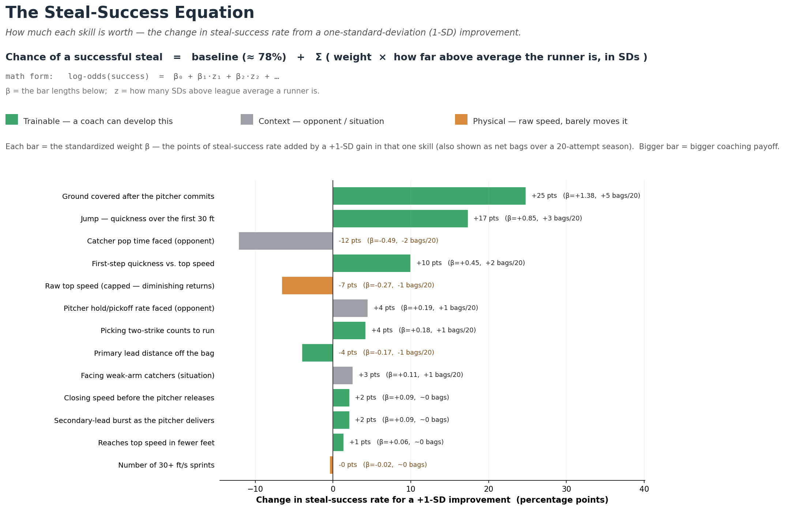
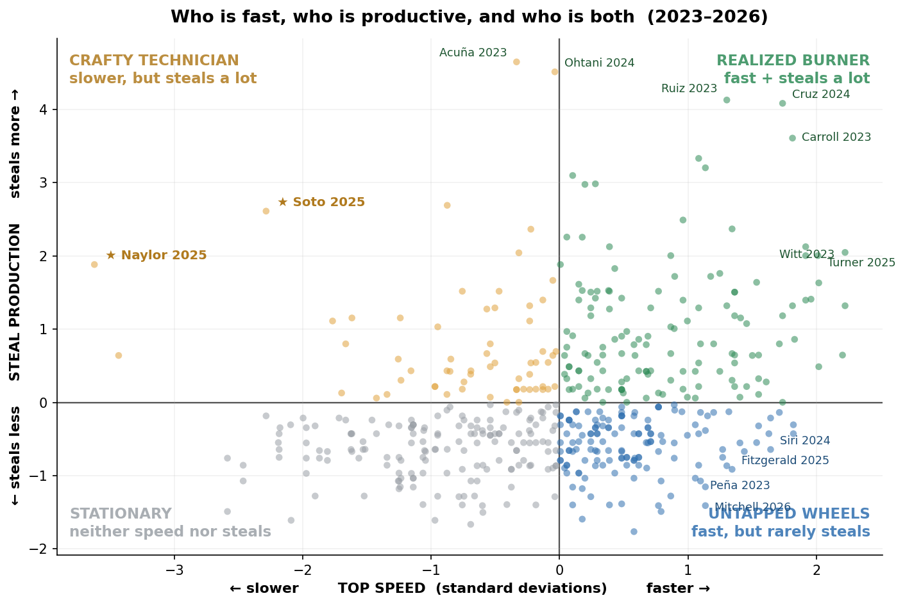
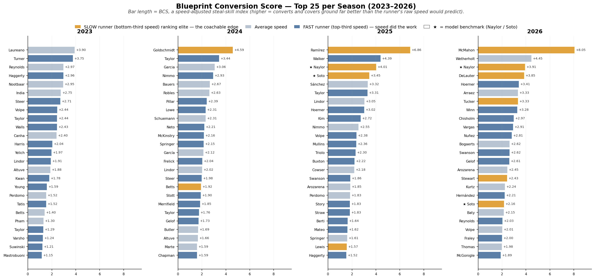
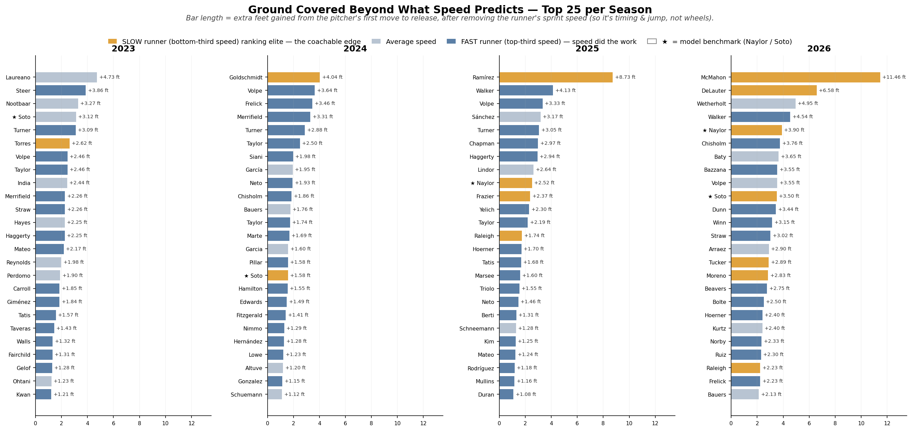
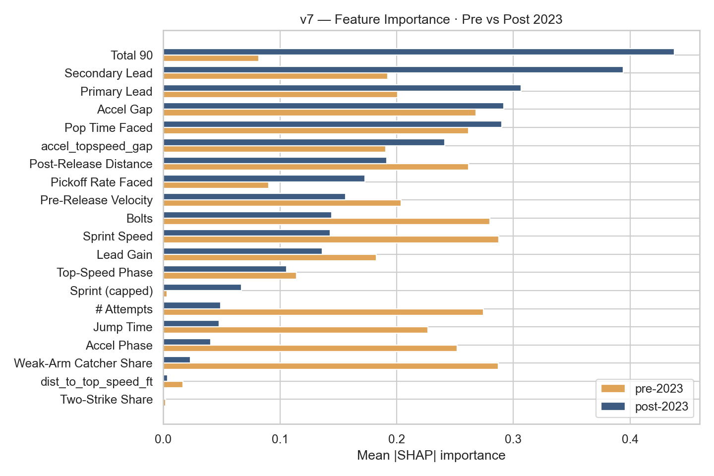
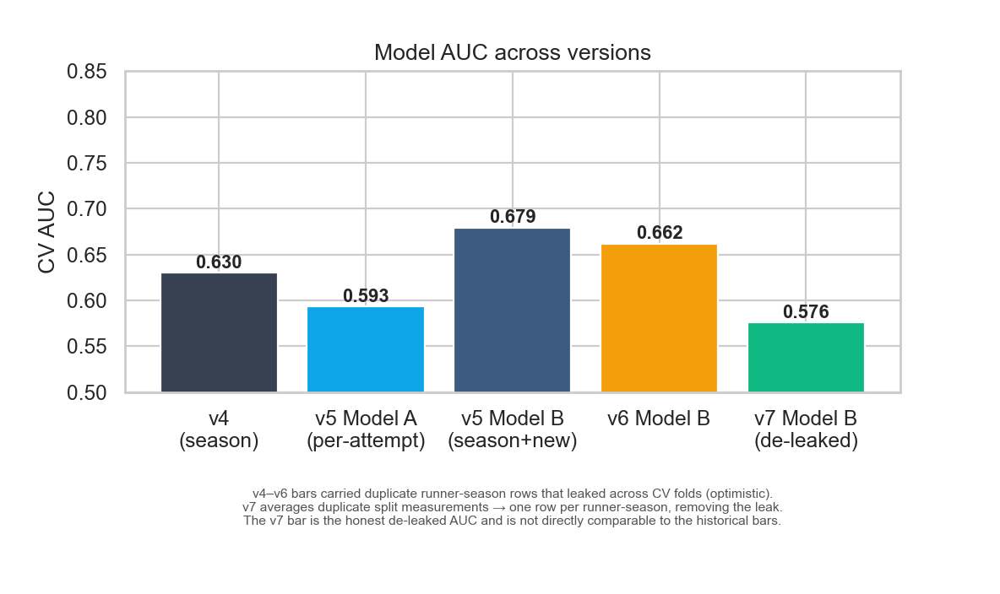
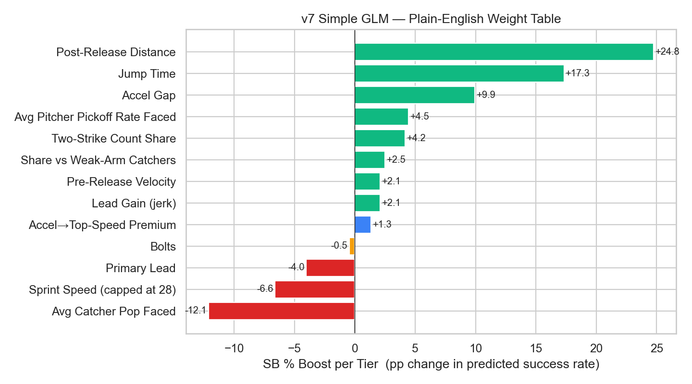

# The Naylor Model

José Caballero led MLB in net stolen bases in 2025 running a quarter-second slower than Chandler Simpson. Shohei Ohtani was the second most productive base-stealer in 2024 despite being 0.14 seconds slower than Elly De La Cruz. Most strikingly, Josh Naylor stole 20 bases above average at 93.8% success while running slower than 97% of the league. Sprint speed is the most intuitive base-stealing metric — it is not the most essential one.

What separates these runners is technique — and technique is coachable precisely because it reflects what a player has learned to do with their body, not what their body is built to do. Sprint speed is structural. Primary lead distance, secondary lead timing, and first-step burst off the pitcher's first move are behavioral patterns that haven't permanently locked in, which means they can be shifted.

Sprint biomechanics research points to three specific targets every baseball player can develop regardless of raw speed: shorter ground contact time, more distance covered in the first five-foot window from the pitcher's first move, and earlier recognition of delivery cues. These aren't elite-only adaptations — they are timing and sequencing refinements accessible to any MLB-level runner. Naylor's edge isn't a physical gift; it's that he optimizes all three within a body most evaluators would write off.

That's why specificity with the biomechanics suite matters. Knowing a runner has a "slow jump" isn't actionable. Knowing exactly where in the ground contact phase they're losing time, and at which keyframe their secondary lead stalls, is. The more precisely the metric targets the problem, the more directly the coaching intervention follows.

---

## Navigation

| | |
|---|---|
| ⭐ **[Main Report — v8 (DOCX)](Reports/Naylor_Model_v8_Report.docx)** | **Start here.** Applied BLUF report for MLB R&D + coaches — the **steal-success equation** (what each trainable skill is worth per +1 SD, in points *and* extra bags), the SSSI skill matrix, the speed-vs-production quadrant, and a **2025 coaching target board** (green-light vs. technique-fix). Plain-English, self-contained pages, built around the *trait* — a slow runner who steals better than ~99% of MLB — not any one player |
| 🧾 **[v8 Technical Appendix (DOCX)](Reports/Naylor_Model_v8_Technical_Appendix.docx)** | Full model detail for auditors — Models A/B/C + de-leaked AUC, complete GLM weight table, full SSSI Top 25, xSB leaderboards, and the Blueprint Conversion Score with **team logos** |
| 📄 **[Comprehensive Report — v7 (DOCX)](Reports/Naylor_Model_v7_Report.docx)** | Prior all-in-one v7 report — Models A/B/C, AUC, GLM, SSSI, xSB **color-coded SD tables**, plus the full Blueprint Conversion Score section (§5.3 archetype profile, per-season Top 25 with **team logos**) |
| 🧬 **[Blueprint Report](Reports/Naylor_Blueprint_Report.pdf)** | Standalone Blueprint Conversion Score — top (Naylor archetype) to bottom (fast squanderers), 2023–2026 |
| 📖 **[Variable Glossary](Reports/Variable_Glossary.pdf)** | Plain-English reference, trimmed 80-20 — every metric on a compact card (units, tiers, example, why it matters) + core model discussion (12 pp) |
| 🖼️ **[Figures](Figures/)** | All charts and visualizations |
| 📊 **[Data Frame](Data%20Frame/)** | All output CSVs — leaderboards, SSSI rankings, model results |
| 🧠 **[Computer Vision](Computer%20Vision/)** | Statcast Analysis Core (Blueprint model) + archived CV delivery-time pilot |
| 🗂️ **[Previous Versions](Previous%20Versions/)** | Archived v3, v4, v5, v6 pipelines and outputs |

---

## Key Results

### The Steal-Success Equation — What Each Trainable Skill Is Worth (per +1 SD)
Every lever's coefficient (β), its points of success-rate change for a one-standard-deviation gain, and the plain-English translation into **extra bags over a 20-attempt season**. Bars are color-keyed: green = trainable, gray = opponent/context, orange = raw speed (barely moves the needle).


### Expected SB Outcome (xSB) — Speed vs Production Quadrant


### Blueprint Conversion Score — Top 25 Per Season (2023–2026)


### Ground Covered Beyond Speed-Expected — Top 25 Per Season (2023–2026)


### Feature Importance — Pre vs Post 2023


### Model Accuracy (AUC)


### GLM Weight Table — What Actually Moves the Needle


---

## How It Works

The core signal is the **SB Residual**: a runner's actual success rate minus the rate their sprint speed alone would predict. Positive means they outperform their speed peers. The model is built on real Statcast data — sprint speed, 5-ft running splits (0–90 ft), catcher pop times, pitcher running-game suppression, and season SB/CS records from 2015–2026.

### Key Metrics

| Metric | What it captures |
|---|---|
| `sprint_speed` | Top running speed (ft/s) — structural baseline |
| `speed_capped` | Sprint speed capped at 28 ft/s — marginal benefit vanishes above this |
| `jump_time` | Time to cover the first 30 ft — first-step burst, independent of top speed |
| `accel_gap` | Jump time percentile minus sprint speed percentile — positive = faster off the line than top speed implies (the Naylor archetype) |
| `accel_topspeed_premium` | **(v7)** How few feet a runner needs to reach top speed, speed-adjusted — a small runway at high speed is a premium |
| `sb_residual` | Real SB% minus speed-expected SB% — ground-truth speed-adjusted steal skill |
| `lead_gain` | Distance gained in secondary lead — a coachable behavioral pattern |
| `xsb_outcome` | **(v7)** `z(net SB above avg) + z(sprint speed)` — combined speed-and-production lens; high = fast AND productive |
| `sb_potential_gap` | **(v7)** `z(sprint) − z(net SB)` — positive = fast but under-stealing (untapped, coachable); negative = over-performs speed |
| `avg_pop_faced` | Catcher pop time in this runner's matchups — battery context |
| `avg_pickoff_rate_faced` | Pitcher hold frequency — suppression context |

### The Steal-Success Equation (v8 — applied)

A logistic model turns the metrics above into one readable equation:

> **chance of a successful steal = baseline (≈ 78%) + Σ ( weight × how far above average the runner is, in SDs )**

Each lever's weight (β) is reported as the **points of success-rate change for a +1-SD gain**, then translated into **net bags over a typical 20-attempt season** so the units never leave plain English (`+5 pp ≈ one extra steal and one fewer caught`). Three *trainable* levers dominate — ground covered after the pitcher commits (**+25 pts ≈ +5 bags**), a quicker jump (**+17 pts ≈ +3 bags**), and reaching top speed in fewer feet (**+10 pts ≈ +2 bags**) — while raw top speed barely moves the needle. See `Figures/Fig_v8_Equation.png`.

### 2025 Coaching Target Board (v8 — applied)

The equation is turned into next steps via two honest, separated tracks — so a caught-prone runner is never simply told to "run more":

| Track | Who | The move |
|---|---|---|
| **Green-light** | Fast, efficient runners (≥ 80% success) who don't run enough | Just let them run — projected extra bags at their own rate |
| **Technique-fix** | High-volume runners caught too often (< 70% success) | Drill the *one* weakest trainable lever — projected success-rate gain |

The boards are priority rankings, not forecasts: *if unleashed* holds a runner at his own 2025 success rate and a modest ~20-attempt volume.

### The SSSI — Slow-Steal Skill Index

A weighted composite of nine z-scored features (v7 adds the Accel→Top-Speed Premium) designed to surface the Naylor/Soto archetype: elite-performing slow runners. Weights were optimised on 80% of runners with Naylor and Soto held out entirely — their ranking is a genuine out-of-sample result.

| Rank | Player | Season | SSSI |
|---|---|---|---|
| 1 | Josh Naylor | 2025 | +1.90 |
| 2 | Josh Naylor | 2026 | +1.84 |
| 3 | Freddie Freeman | 2024 | +1.71 |
| 5 | Juan Soto | 2025 | +1.43 |

### xSB — Expected Stolen-Base Outcome (v7)

A **complementary** lens to the SSSI. Where the SSSI surfaces slow-but-skilled stealers, **xSB = `z(net SB above avg) + z(sprint speed)`** surfaces the high-ceiling runners who are both fast *and* productive. The companion **`sb_potential_gap` = `z(sprint) − z(net SB)`** splits the league into four quadrants:

| Quadrant | Read |
|---|---|
| **Realized Burner** | Fast and productive — the complete package (e.g. Elly De La Cruz) |
| **Untapped Wheels** | Fast but under-stealing — coaching targets, split into *green-light* (efficient, just let them run) and *technique-fix* (caught too often, drill mechanics first) |
| **Crafty Technician** | Productive despite modest speed — the Naylor / Soto archetype |
| **Stationary** | Neither speed nor steal production |

xSB is descriptive, not predictive — it is deliberately kept out of the GBM (z(SB) would leak the outcome) and out of the SSSI composite.

### Blueprint Conversion Score — Top 5 All-Time (2023–2026)

| Rank | Player | Team | Season | BCS |
|---|---|---|---|---|
| 1 | Ryan McMahon | NYY | 2026 † | +8.05 |
| 2 | Agustín Ramírez | MIA | 2025 | +6.86 |
| 3 | Paul Goldschmidt | STL | 2024 | +4.59 |
| 6 | Josh Naylor | SEA | 2025 | +4.01 |
| 11 | Juan Soto | NYM | 2025 | +3.45 |

*† 2026 partial season (~1/3 complete, May 2026); min 3 tracked Statcast attempts.*

### Models

| Model | Unit | AUC | Purpose |
|---|---|---|---|
| **Model B** (season GBM) | Runner-season | 0.589 (full) · 0.608 (pre-23) | Headline predictor |
| Model A (per-attempt GBM) | Individual attempt | ~0.59 | Strict noise-floor test |
| GLM | Runner-season | — | Interpretable weight table |

> **AUC caveat (v7 de-leaking).** Earlier versions (v4–v6) reported AUCs of ~0.66–0.70, but those
> runs carried **duplicate runner-season rows** — repeated Statcast split measurements for the same
> player-season — that leaked across cross-validation folds and inflated the score. v7 averages those
> duplicate splits into one row per runner-season, removing the leak. The v7 AUC (0.589 full, 0.608
> pre-2023) is **lower but honest** — not a regression, just the first de-leaked estimate. The
> historical bars in `Fig_v7_AUC.png` are kept for context only and are not a fair comparison.

---

## How to Run

```bash
# Full v7 model pipeline
python3 v7_explore.py        # full pipeline → "Data Frame"/, Figures/, Reports/ (CSVs, figures, xlsx)
python3 build_v8_report.py   # ⭐ 4-page BLUF main report + Technical Appendix (reads v7 CSVs, no re-run needed)
python3 build_v7_report.py   # prior comprehensive v7 report → Reports/Naylor_Model_v7_Report.docx
python3 write_glossary.py    # regenerate Variable Glossary → Reports/

# Blueprint pipeline (Jupyter notebooks — recommended)
jupyter notebook "Computer Vision/Statcast Analysis Core/Data Pipeline.ipynb"
jupyter notebook "Computer Vision/Statcast Analysis Core/Blueprint Analysis.ipynb"

# Or run scripts directly (requires network for data pipeline)
python3 "Computer Vision/Statcast Analysis Core/ground_covered_leaderboard.py"
python3 "Computer Vision/Statcast Analysis Core/naylor_blueprint.py"
```

---

## Repository Structure

```
The-Naylor-Model/
├── v7_explore.py              ← full v7 pipeline (SSSI, Model B, GLM, xSB, figures)
├── build_v8_report.py         ← ⭐ 4-page BLUF main report + Technical Appendix (plain-English, self-contained pages)
├── build_v7_report.py         ← prior comprehensive v7 DOCX (color-coded tables, logos, BCS section)
├── write_glossary.py          ← Variable Glossary generator (compact 80-20 cards)
├── Figures/                   ← all output PNGs (incl. per-season BCS figures + logos/)
├── Data Frame/                ← Naylor Blueprint.xlsx (4 sheets), v7 Model.xlsx (9 sheets)
├── Reports/                   ← v8 main report + Technical Appendix (DOCX), v7 report, glossary, PDFs
├── Computer Vision/
│   ├── Statcast Analysis Core/
│   │   ├── Data Pipeline.ipynb        ← discover runners + fetch leads + ground covered
│   │   ├── Blueprint Analysis.ipynb   ← BCS scoring + figures + DOCX rebuild
│   │   ├── discover_runners.py        ← Savant sprint/SB universe fetcher
│   │   ├── fetch_leads.py             ← per-attempt leads fetcher (imported by pipeline)
│   │   ├── ground_covered_leaderboard.py ← gain-to-release leaderboard (2023–2026)
│   │   ├── naylor_blueprint.py        ← BCS model + per-season Top/Bot 25 tables
│   │   └── build_blueprint_report.js  ← Node.js DOCX builder
│   ├── discovery/             ← runner universe CSVs (2023–2026)
│   └── discovery/leads_cache/ ← per-attempt leads cache (gitignored, regenerable)
└── Previous Versions/
    ├── v3/                    ← naylor_model.py + v3 outputs
    ├── v4/                    ← v4_explore.py + v4 outputs
    ├── v5/                    ← v5_explore.py + v5 outputs
    └── v6/                    ← v6_explore.py + v6 outputs (figures, v6 Model.xlsx)
```

---

## Data Sources

- Baseball Savant: sprint speed, running splits, catcher pop times, pitcher running-game leaderboard, base-stealing run value
- MLB Stats API: season SB/CS records (2015–2026)
- Statcast pitch-level feed: per-pitch runner context, battery matchups
