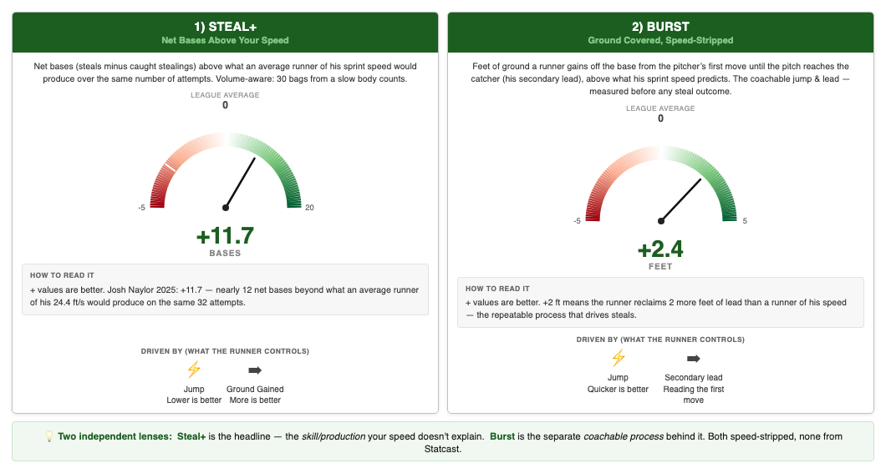
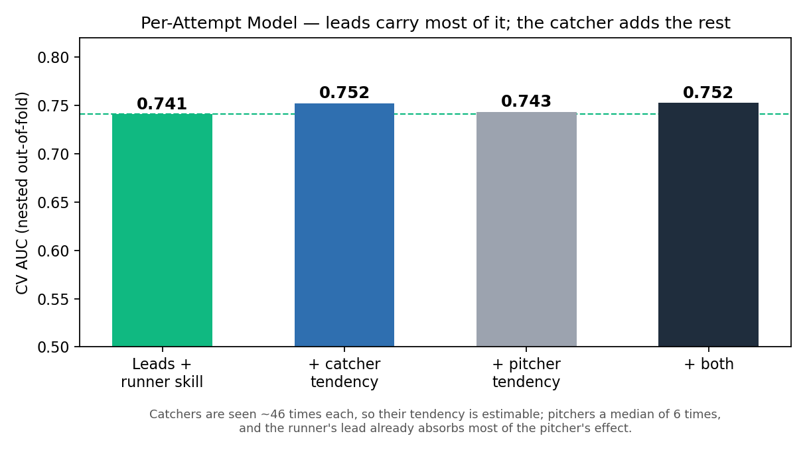

# The Naylor Model

> ### Open this first  (v11)
> | If you want to… | Open |
> |---|---|
> | **Explore the model** (interactive, local web app) | **[`docs/index.html`](docs/index.html)** — sortable leaderboard, click any runner for the Net-Bases breakdown, the skill map, and the evidence panel |
> | **Read the findings** (coaches / R&D) | **[`Naylor_Model_v11_Report.docx`](Naylor_Model_v11_Report.docx)** |
> | **Run the model** end-to-end | **[`Naylor_Model.ipynb`](Naylor_Model.ipynb)** — built n=1 → n=5 → full, every claim validated |
> | **See the raw data** | `Data/Raw_Season.csv` (runner-seasons) · `Data/Raw_Attempts.csv` (per attempt) |
> | **See the outputs** | `Output/Figures/` · `Output/Results/` (`DF_v11_leaderboard.csv`, `DF_v11_validation.csv`) |
> | **Improve the AUC** | [`AUC_Roadmap.md`](AUC_Roadmap.md) |
>
> | **See it live** | **https://shunnchenn.github.io/The-Naylor-Model/** |
>
> Everything else is plumbing: `Scripts/` (three analysis scripts — scrape, features, model) ·
> `Data/` (raw in) · `Output/` (results out).

---

José Caballero led MLB in net stolen bases in 2025 running a quarter-second slower than Chandler Simpson. Shohei Ohtani was the second most productive base-stealer in 2024 despite being 0.14 seconds slower than Elly De La Cruz. Most strikingly, Josh Naylor stole 30 bases at 94% success while running slower than 98% of the league. Sprint speed is the most intuitive base-stealing metric — it is not the most essential one.

What separates these runners is technique — and technique is coachable precisely because it reflects what a player has learned to do with their body, not what their body is built to do. Sprint speed is structural. Primary lead distance, secondary lead timing, and first-step burst off the pitcher's first move are behavioral patterns that haven't permanently locked in, which means they can be shifted.

Sprint biomechanics research points to three specific targets every baseball player can develop regardless of raw speed: shorter ground contact time, more distance covered in the first five-foot window from the pitcher's first move, and earlier recognition of delivery cues. These aren't elite-only adaptations — they are timing and sequencing refinements accessible to any MLB-level runner. Naylor's edge isn't a physical gift; it's that he optimizes all three within a body most evaluators would write off.

---

## What v11 asks — and proves

**One question:** *is there a base-stealing number more useful than Net Bases Gained (SB − CS)?*

Net Bases Gained tells you *what happened* but bundles five things — sprint speed, volume, opponent difficulty, execution, and luck — so it can't tell you *why*, whether it's *coachable*, or whether it will *repeat*. (Statcast's SB Run Value doesn't separate them either: empirically a fixed credit per steal minus a larger debit per caught, correlated **+0.85** with Net Bases and **+0.23** with sprint speed.) v11 strips speed out and isolates the coachable slice — then **validates every claim** against the data.

### Two independent metrics — kept separate, not blended

| Metric | What it is | Unit | 0 = |
|---|---|---|---|
| **Steal+** (headline) | Net bases (SB − CS) above what an average runner of his **sprint speed** would produce over the same attempts. `= 2(1−p)·SB − 2p·CS`, so a caught stealing costs **~4×** a steal (p ≈ speed-expected success ≈ 0.80). **Volume-aware.** | bases | same-speed average |
| **Burst** (a separate lens) | Feet of ground the runner gains off the base (first move → pitch reaches the catcher, his secondary lead) **above what his speed predicts** — measured *before any steal outcome.* The coachable jump/lead; replaces v10's "SB Run Value." | feet | speed-predicted |

They're kept **separate** (near-zero correlation, r ≈ 0.16): Steal+ answers *who steals well*, Burst answers *who has coachable, repeatable technique*. A v10 "Steal Grade" averaged their percentiles; **dropped in v11** — validation showed it predicts net steals / success no better than Steal+ alone and mis-ranks pure producers (Ohtani graded ~109th; he leads Steal+).

Plus the exact decomposition: **Net Bases = NetSpeed + Steal+** — NetSpeed is the net bases your wheels alone buy (`attempts × (2·p_speed − 1)`), Steal+ is the net bases your skill adds. (Steal+ *is* the surplus term.)

### The validation (see `Output/Results/DF_v11_validation.csv`)

| Question | Net Bases | Steal+ | Burst | Verdict |
|---|---|---|---|---|
| **corr with sprint speed** (0 = pure skill) | +0.30 | **−0.01** | **+0.00** | Steal+/Burst are speed-neutral |
| **describes net steals** (SB−CS, same year) | — | **+0.64** | +0.08 | Steal+ is the production read |
| **describes success rate** (same year) | — | **+0.88** | +0.15 | Steal+ tracks efficiency |
| predict next-year **net steals** | **+0.32** | +0.14 | +0.05 | **Net Bases wins** volume — we concede it |
| predict next-year **success rate** | +0.13 | **+0.20** | +0.04 | Steal+ wins skill |
| **year-to-year stability** (repeatable) | +0.32 | +0.17 | **+0.47** | Burst is the most repeatable |

The honest read: **Steal+ is the single best answer to "who steals well"** — it describes same-season net steals (0.64) and success rate (0.88) far better than anything else while staying speed-neutral. **Burst is a genuinely different, more repeatable signal** (year-to-year 0.47) for coachable technique. Net Bases still wins raw next-year volume.

---

## Key Results

### The scorecard — two metrics, all in clear units


### The evidence — three honest wins


### The decomposition — Net Bases = NetSpeed + Steal+


### The skill engine — per-attempt model accuracy (AUC)


---

## How It Works

The model has two clearly separated jobs — kept apart on purpose:

1. **The skill engine (per attempt).** A per-attempt XGBoost over **~11,000 individual tracked attempts** (one row per steal, with the lead distances the runner got on that pitch). CV **AUC ≈ 0.74**. It answers a *within-attempt* question — *given how this runner led off on this pitch, did the attempt succeed?* — driven by the per-pitch lead distances. **It is not a season forecast and not a next-season projection.** It lives in `Scripts/model_v11.py` (`run_perattempt`).

2. **The metric suite (per runner-season).** `Scripts/model_v11.py` turns the season data into Steal+ (headline), Burst, and the Net-Bases decomposition. It is written in two stages so it can be trusted:
   - `fit_league(era)` learns the league constants (the `ground ~ sprint_speed` line, the percentile references) **once** on the whole pool;
   - `score(rows, fit)` is then a **pure function** — scoring 1 row, 5 rows, or 408 gives identical values for the same players.

   The notebook exploits this to test like a coder: **n=1 → n=5 (two players) → full**, asserting the decomposition closes exactly at each step, then **proving the test rows are byte-identical** to the full run.

3. **Projection is validated separately** by the year T → T+1 correlations above — the only place the model speaks to "next season," and it does so honestly (Net Bases is the better volume forecaster; v11 wins on skill, efficiency, and technique).

*† 2026 is a partial season (~1/3 complete); the era pool is the 2023–26 Statcast lead-tracking window, 408 runner-seasons.*

---

## How to Run

Three scripts, one job each — scrape → features → model:

```bash
# Rebuild the v11 outputs (no network — reads Data/)
python3 Scripts/model_v11.py       # metrics + validation + per-attempt AUC → Data/v11_players.json,
                                   #   Output/Results/DF_v11_*.csv + DF_perattempt_*.csv + Fig_AUC/Importance.png

# Regenerate the raw data from scratch (network → Savant / MLB API)
python3 Scripts/scrape_statcast.py discover --start 2023 --end 2026 --expand   # per-attempt leads → Data/leads_cache
python3 Scripts/scrape_statcast.py assets                                       # headshots + team_map.csv
python3 Scripts/build_features.py  # leads_cache + season features → Data/Raw_Season.csv + Raw_Attempts.csv
```

The per-attempt AUC stage inside `model_v11.py` needs `xgboost` + `scikit-learn`; if they are
not installed it is skipped with a note and the season metrics still build.

---

## Repository Structure

The root holds the report, one notebook, and the web app; raw in, results out:

```
The-Naylor-Model/                       ← = v11
├── Naylor_Model_v11_Report.docx        ← ⭐ the applied report (the question, the evidence, the decomposition)
├── Naylor_Model.ipynb                  ← ⭐ master notebook (raw → per-attempt AUC → n=1/n=5/full metrics → validation)
├── docs/                               ← ⭐ the live web app (GitHub Pages serves this)
├── README.md
├── Data/            ← Raw_Season.csv, Raw_Attempts.csv, v11_players.json, team_map.csv, leads_cache/ (gitignored)
├── Output/          ← Figures/ · Results/ (DF_v11_* + DF_perattempt_*)
└── Scripts/         ← THREE analysis scripts, one job each:
                       scrape_statcast (all web scraping), build_features (feature engineering),
                       model_v11 (the metrics + the per-attempt AUC model, fit/score)
```

---

## Data Sources

- Baseball Savant: sprint speed, running splits, catcher pop times, pitcher running-game leaderboard, base-stealing run value
- MLB Stats API: season SB/CS records (2015–2026)
- Statcast pitch-level feed: per-pitch runner context, battery matchups
