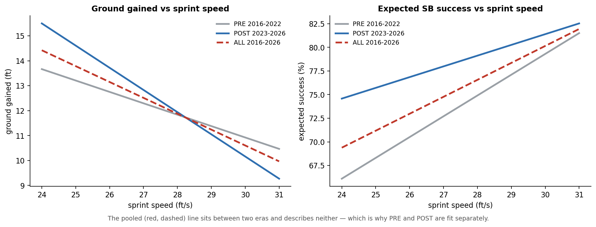
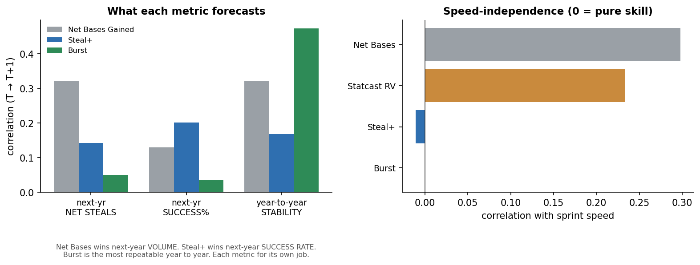
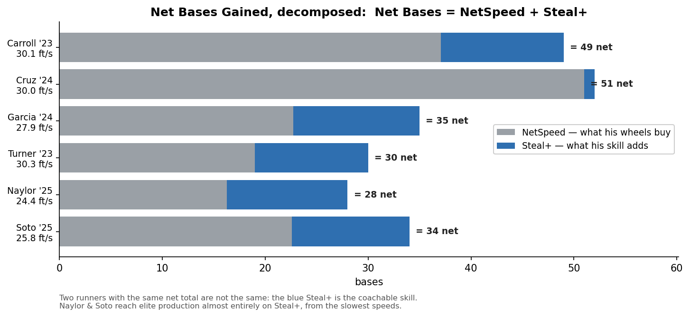

# The Naylor Model

## ▶ **[Try the steal-odds calculator](https://shunnchenn.github.io/The-Naylor-Model/#calc)** &nbsp;·&nbsp; [explore the full model](https://shunnchenn.github.io/The-Naylor-Model/)

**Drag four sliders — sprint speed, the lead he already had, the ground he gained from there, and
the catcher's pop time — and see the modelled odds that a stolen-base attempt is safe.** Runs in the
browser, nothing to install.

> A slow runner with a great jump (24.4 ft/s, 16.7 ft gained) reads **86 %**.
> An elite sprinter with a poor jump (30.5 ft/s, 8 ft) reads **80 %**.
> And the catcher swings it hard: that same slow runner reads **81 %** against an elite 1.85 s pop
> time and **93 %** against a slow 2.05 s one.

---

> ### Then dig in  (v15)
> | If you want to… | Open |
> |---|---|
> | **Try the calculator** | **https://shunnchenn.github.io/The-Naylor-Model/#calc** — 4 sliders, live |
> | **Explore the leaderboard** | **https://shunnchenn.github.io/The-Naylor-Model/** — sortable board, player cards with percentile bars, skill map |
> | **Read the findings** | **[`Naylor_Model_v15_Report.docx`](Naylor_Model_v15_Report.docx)** — ⭐ the single report: data, model spec, results, robustness, limitations |
> | **Run the model** end-to-end | **[`Naylor_Model.ipynb`](Naylor_Model.ipynb)** — built n=1 → n=5 → full, every claim validated |
> | **See the raw data** | `Data/Raw_Season.csv` (runner-seasons) · `Data/Raw_Attempts.csv` (per attempt) |
> | **See the outputs** | `Output/Figures/` · `Output/Results/` (`DF_v15_leaderboard.csv`, `DF_v15_validation.csv`) |
> | **Improve the AUC** | [`AUC_Roadmap.md`](AUC_Roadmap.md) |
>
> Everything else is plumbing: `ingest/` (scrape → features) · `model/` (the ML) ·
> `Data/` (raw in) · `Output/` (results out).

---

José Caballero led MLB in net stolen bases in 2025 running a quarter-second slower than Chandler Simpson. Shohei Ohtani was the second most productive base-stealer in 2024 despite being 0.14 seconds slower than Elly De La Cruz. Most strikingly, Josh Naylor stole 30 bases at 94% success while running slower than 98% of the league. Sprint speed is the most intuitive base-stealing metric — it is not the most essential one.

What separates these runners is technique — and technique is coachable precisely because it reflects what a player has learned to do with their body, not what their body is built to do. Sprint speed is structural. Primary lead distance, secondary lead timing, and first-step burst off the pitcher's first move are behavioral patterns that haven't permanently locked in, which means they can be shifted.

Sprint biomechanics research points to three specific targets every baseball player can develop regardless of raw speed: shorter ground contact time, more distance covered in the first five-foot window from the pitcher's first move, and earlier recognition of delivery cues. These aren't elite-only adaptations — they are timing and sequencing refinements accessible to any MLB-level runner. Naylor's edge isn't a physical gift; it's that he optimizes all three within a body most evaluators would write off.

---

## What the model asks — and proves

**One question:** *is there a base-stealing number more useful than Net Bases Gained (SB − CS)?*

Net Bases Gained tells you *what happened* but bundles five things — sprint speed, volume, opponent difficulty, execution, and luck — so it can't tell you *why*, whether it's *coachable*, or whether it will *repeat*. (Statcast's SB Run Value doesn't separate them either: empirically a fixed credit per steal minus a larger debit per caught, correlated **+0.85** with Net Bases and **+0.23** with sprint speed.) v11 strips speed out and isolates the coachable slice — then **validates every claim** against the data.

### The three numbers — raw, speed-adjusted, and the result

| Metric | What it is | Unit | 0 = |
|---|---|---|---|
| **Steal+** (headline) | Net bases (SB − CS) above what an average runner of his **sprint speed** would produce over the same attempts. `= 2(1−p)·SB − 2p·CS`, so a caught stealing costs **~4×** a steal (p ≈ speed-expected success ≈ 0.80). **Volume-aware.** | bases | same-speed average |
| **Ground gained** (the raw measurement) | Feet the runner wins from the pitcher's **first move** until the pitcher's **release** (Savant `r_secondary_lead − r_primary_lead`). The endpoint is release, not the ball arriving at the catcher — the per-attempt feed carries no ball-arrival timestamp, so that endpoint is not observable here. On a single pitch this is the strongest lever in the model — each extra foot ≈ **1.36×** the odds of being safe. **Not speed-neutral:** it correlates **−0.48** with sprint speed, because slower runners take bigger secondary leads. | feet | — (raw) |
| **Burst** (the same thing, speed-adjusted) | Ground gained **minus what a runner of that sprint speed typically gains**. Correlation with sprint speed: **0.00**. This is the fair cross-runner comparison, measured *before any steal outcome* — the coachable jump/lead; replaces v10's "SB Run Value." | feet | speed-predicted |

**Ground gained vs Burst — the distinction that matters.** They are *the same measurement at two baselines*, correlated **+0.87** but not interchangeable. Rank by raw ground gained and you systematically flatter slow runners:

| Runner | Sprint speed | Ground gained | Burst |
|---|---|---|---|
| **Josh Naylor** '25 | 24.4 ft/s | **15.9 ft** (the most) | +1.3 |
| **Corbin Carroll** '23 | 30.1 ft/s | 12.6 ft | **+2.1** (the better jump) |

Naylor wins the most raw ground of anyone — but he is slow, and slow runners are *expected* to. At 30.1 ft/s, Carroll's 12.6 ft is the harder feat. Burst is what makes that comparison fair. Both are shown side by side on the leaderboard.

Steal+ and Burst are kept **separate** (near-zero correlation, r ≈ 0.16): Steal+ answers *who steals well*, Burst answers *who has coachable, repeatable technique*. A v10 "Steal Grade" averaged their percentiles; **dropped in v11** — validation showed it predicts net steals / success no better than Steal+ alone and mis-ranks pure producers (Ohtani graded ~109th; he leads Steal+).

Plus the exact decomposition: **Net Bases = NetSpeed + Steal+** — NetSpeed is the net bases your wheels alone buy (`attempts × (2·p_speed − 1)`), Steal+ is the net bases your skill adds. (Steal+ *is* the surplus term.)

### The validation (see `Output/Results/DF_v15_validation.csv`)

| Question | Net Bases | Steal+ | Burst | Verdict |
|---|---|---|---|---|
| **corr with sprint speed** (0 = pure skill) | +0.29 | **−0.01** | **+0.00** | Steal+/Burst are speed-neutral |
| **describes net steals** (SB−CS, same year) | — | **+0.64** | +0.10 | Steal+ is the production read |
| **describes success rate** (same year) | — | **+0.89** | +0.16 | Steal+ tracks efficiency |
| predict next-year **net steals** | **+0.38** | +0.17 | +0.09 | **Net Bases wins** volume — we concede it |
| predict next-year **success rate** | +0.16 | **+0.23** | +0.04 | Steal+ wins skill |
| **year-to-year stability** (repeatable) | +0.38 | +0.19 | **+0.46** | Burst is the most repeatable |

The honest read: **Steal+ is the single best answer to "who steals well"** — it describes same-season net steals (0.64) and success rate (0.89) far better than anything else while staying speed-neutral. **Burst is a genuinely different, more repeatable signal** (year-to-year 0.46) for coachable technique. Net Bases still wins raw next-year volume.

---

## What v15 changed

v15 consolidates every earlier write-up (v11–v14 and the separate Results & Discussion) into a
single ML report, and restructures the code into five scripts across `ingest/` and `model/`.
The modelling changes below arrived across v12–v15; none of them overturned a published
Steal+, Burst or leaderboard value — they made the findings defensible.

| Change | Why | Effect |
|---|---|---|
| **Dropped `lead_at_release_ft`** from the per-attempt model | It is the *exact sum* of the other two lead features (R² = **0.999895**; the residual caps at 0.1 ft, the rounding granularity). VIF **1,588 / 5,836 / 9,532**. | Predictions unchanged (−0.0014 AUROC), but feature importance was being split arbitrarily across dependent columns and was **not quotable**. Now max VIF **1.14**. |
| **`pc_fastball` made the reference category** | The three pitch-class dummies sum to 1 on 99.94% of rows — the dummy-variable trap. VIF 561. | Coefficients readable relative to a fastball. |
| **Calculator re-specified**: speed + lead at first move + ground gained + **catcher pop time** | Measured, not assumed. Burst requires a *qualified* runner-season, so carrying it discarded ~3,600 attempts. | AUROC **0.726 → 0.756** on **10,844** attempts (up from 7,404). Burst stays a season metric; it is not a per-pitch input. |
| **Every accuracy number printed beside its floor** | AUPRC without its no-skill floor reads better than it is; v13's F1 at the 0.5 threshold is structurally **0.000** at a 2.3% base rate. | See §5.2 of the v15 report. |
| **Eras fit separately**, pooling priced and rejected | The 2023 rules moved both baselines. | Pooling barely moves ranks (Spearman 0.994) but Burst **stops being speed-neutral** (0.00 → −0.139). |
| **Standing collinearity guard** added to the verification harness | Nothing in the pipeline noticed the dependency above. | `assert max VIF < 10`; it caught two of the three defects on its first run. |
| **`ground` (and therefore Burst) now blended from the calculator's own coefficients** — a weighted average of lead-at-first-move and gain-to-release, weighted 19%/81% by the calculator's fitted odds ratios rather than using gain-to-release alone | So the season metric reflects the same two quantities, weighted the same way, as the per-pitch calculator — a plain unweighted average of the two was tested first and made Burst *less* repeatable (YoY 0.53 → 0.38); the calculator-weighted version recovers nearly all of that (YoY 0.49). | Burst YoY 0.48 → 0.46 (small, disclosed cost). `ground_weights()` in `model/metrics.py`. |
| **Isotonic calibration layer, shipped** | The raw logistic ranks well but states a poor *rate*: out of fold it reads ~0.876 where the observed rate is 0.919, with **5 of 10 deciles** more than two binomial SE off. The calculator prints that number as a probability, so the error was the user-facing claim. The miscalibration is a **wave** (over-confident in deciles 2–3, under-confident in 6–8) whose signed gaps cancel to −0.0000 — so no global shift helps, and Platt measurably makes it worse. | ECE **0.0208 → 0.0091** with **0** deciles beyond 2 SE; Brier 0.1359 → 0.1350. Costs 0.003 AUROC (0.7559 → 0.7528), an order of magnitude inside the bootstrap CI. Both eras ship their own map. |

---

## Key Results

### The two league baselines — and what the slopes mean


These are the only two lines the model subtracts from, so neither metric can be checked without
them. **Left:** the line slopes *downward* (−0.72 ft per ft/s) — every extra 1 ft/s of sprint speed
comes with ~0.72 **fewer** feet of ground gained, because faster runners take shorter leads. That is
why raw ground gained is partly a slow-runner statistic, and **Burst is the vertical gap above this
line** (correlation with speed 0.00, versus −0.48 for raw ground gained). **Right:** the steepness
*is* the price of raw speed — one extra ft/s bought **+2.20** points of success before 2023 and only
**+1.14** after, while the whole league's floor rose (76.4% → 80.4%). The 2023 rules roughly halved
what wheels are worth, which is the strongest single argument against pooling the eras.

### The scorecard, in clear units


### The evidence — three honest wins


### The decomposition — Net Bases = NetSpeed + Steal+


### The skill engine — per-attempt model accuracy (AUC)


---

## How It Works

The model has two clearly separated jobs — kept apart on purpose:

1. **The skill engine (per attempt).** A per-attempt XGBoost over **~11,100 individual tracked attempts** (one row per steal, with the lead distances the runner got on that pitch). CV **AUROC ≈ 0.78** (v12: 0.741 leads-only → 0.783 with pitch context and catcher arm; **0.770 under a forward train-past/test-future holdout**, the honest number). It answers a *within-attempt* question — *given how this runner led off on this pitch, did the attempt succeed?* — driven by the per-pitch lead distances. **It is not a season forecast and not a next-season projection.** It lives in `model/metrics.py` (`run_perattempt`).

2. **The metric suite (per runner-season).** `model/metrics.py` turns the season data into Steal+ (headline), Burst, and the Net-Bases decomposition. It is written in two stages so it can be trusted:
   - `fit_league(era)` learns the league constants (the `ground ~ sprint_speed` line, the percentile references) **once** on the whole pool;
   - `score(rows, fit)` is then a **pure function** — scoring 1 row, 5 rows, or all 452 gives identical values for the same players. `model_eras.py` asserts this over 200 random draws of 5 per era, against a deliberately leaky scorer as a negative control.

   The notebook exploits this to test like a coder: **n=1 → n=5 (two players) → full**, asserting the decomposition closes exactly at each step, then **proving the test rows are byte-identical** to the full run.

3. **Projection is validated separately** by the year T → T+1 correlations above — the only place the model speaks to "next season," and it does so honestly (Net Bases is the better volume forecaster; v11 wins on skill, efficiency, and technique).

*† The modern pool is the 2023–2026 Statcast lead-tracking window, **452 runner-seasons** (2026 current through 2026-07-17). A **separate classic model** covers **2015–2022** (1,280 runner-seasons) — same Steal+/Burst architecture, re-fit on its own league constants because the 2023 rule changes (disengagement limit, bigger bases, pitch clock) made the eras non-comparable. See §7.1 of the v15 report and `model/metrics.py classic`.*

---

## How to Run

Five scripts: two that ingest, three that model.

```bash
# Rebuild everything from what is already on disk (no network)
python3 model/metrics.py            # Steal+/Burst + the calculator → Data/v15_players.json,
                                    #   Output/Results/DF_v15_*.csv, Fig_AUC/Importance/ROC
python3 model/metrics.py eras       # three-era comparison + EVERY verification guard (asserts)
python3 model/engines.py success    # v12 per-attempt XGBoost with full pitch/battery context
python3 model/engines.py decision   # v13 per-opportunity decision model
python3 model/decompose.py          # row-level audit of the calculator: every logit term per
                                    #   attempt, manual vs sklearn, bootstrap / permutation /
                                    #   calibration / learning curve  (--quick for fewer resamples)

# Re-fit the classic era (needs network — pulls season SB/CS from the Stats API)
python3 model/metrics.py classic

# Regenerate the raw data from scratch (network → Savant / MLB API)
python3 ingest/scrape_statcast.py discover --start 2023 --end 2026 --expand
python3 ingest/scrape_statcast.py assets
python3 ingest/build_features.py    # leads_cache + season features → Raw_Season.csv / Raw_Attempts.csv
```

The per-attempt stages need `xgboost` + `scikit-learn`; without them they are skipped with a note
and the season metrics still build.

---

## Repository Structure

```
The-Naylor-Model/
├── Naylor_Model_v15_Report.docx   ← ⭐ THE report — data, model, results, robustness, limitations
├── Naylor_Model.ipynb             ← ⭐ master notebook (raw → AUC → n=1/n=5/full metrics → validation)
├── docs/                          ← ⭐ the live web app (GitHub Pages serves this)
├── README.md · AUC_Roadmap.md
├── Data/       ← Raw_Season.csv, Raw_Attempts.csv, v15_players.json, leads_cache/ (gitignored)
├── Output/     ← Figures/ · Results/ (DF_v15_* · DF_v12_* · DF_v13_* · DF_eras_* · DF_classic_*)
├── ingest/     ← getting the data in
│   ├── scrape_statcast.py   the ONLY script that touches the network
│   └── build_features.py    leads_cache + raw pulls → the two modelling tables
└── model/      ← the ML, in pipeline order
    ├── metrics.py     season metrics (Steal+ / Burst / decomposition), the 4-input logistic
    │                  calculator, the classic-era re-fit, the three-era comparison, and the
    │                  verification harness.   [modern | classic | eras]
    ├── engines.py     per-event models: v12 success-given-attempt, v13 attempt-or-not.
    │                  [success | decision]
    └── decompose.py   row-level audit of the shipped calculator — every logit term per attempt,
                       manual vs sklearn, bootstrap / permutation / calibration / learning curve.
```

Five `.py` files total. `model/metrics.py eras` and `model/decompose.py` **assert** their checks
rather than printing them, so a leak, a collinearity regression, or drift from the committed fit
fails the run instead of producing a quiet warning.

---

## Data Sources

The **2023–2026** Statcast lead-tracking window is the only one in which per-attempt lead distances
exist, and it is what `model/metrics.py` publishes (`ERA_MIN = 2023`). `model/metrics.py classic`
covers **2015–2022** as a **separate fit on its own league constants**, and `model/metrics.py eras`
compares the two — the 2023 rule package (disengagement limit, bigger bases, pitch clock) moved both
baselines, so the eras are never pooled into a single published number.

- **Baseball Savant** — per-attempt lead distances and SB run value (the base-stealing drawer),
  sprint speed and running splits, catcher pop time and arm strength.
- **MLB Stats API** — league-wide season SB/CS totals, and per-game play-by-play used for
  per-pitch base state, count, and pitcher/batter handedness (the v12 context and the v13
  opportunity denominator).
